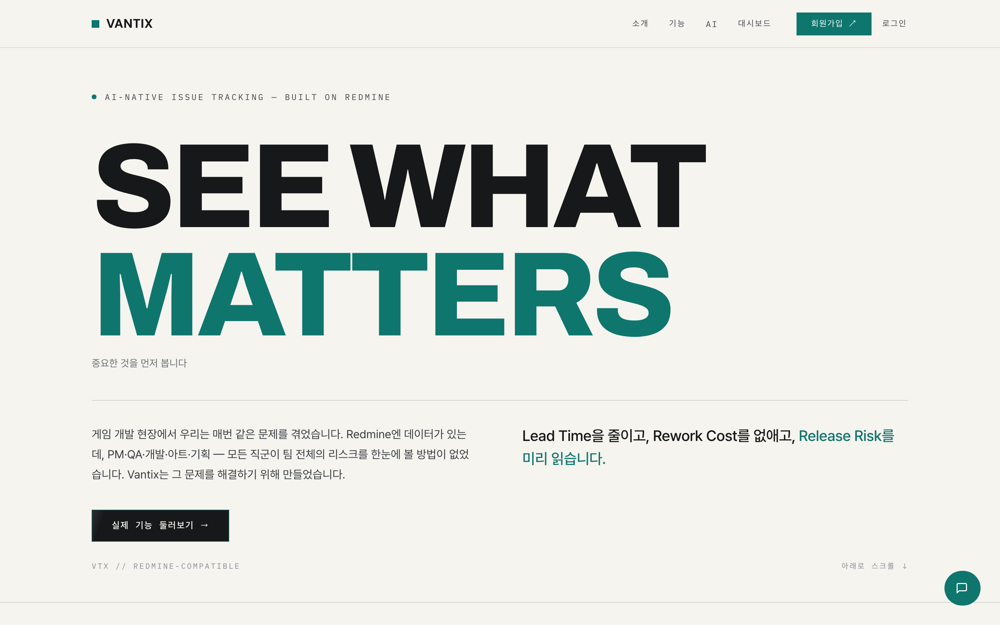
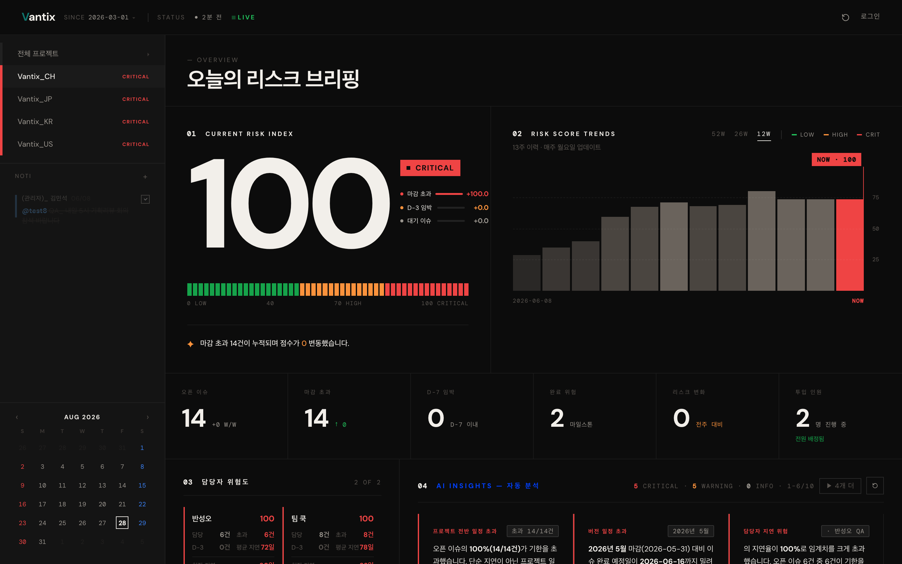
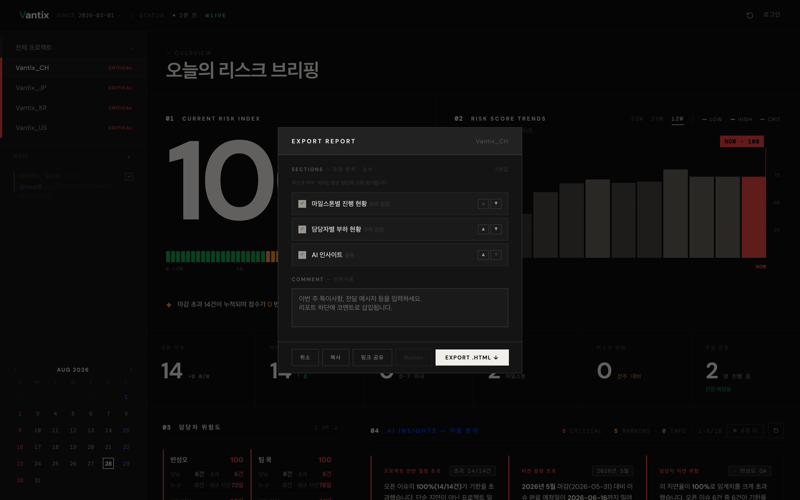

# Vantix

**AI 기반 Redmine 프로젝트 리스크 분석 대시보드** — 팀 전체의 일정 리스크를 한 화면에서 조기에 포착한다.

FastAPI 단일 서비스 · Redmine REST 연동 · 배포: Railway

[](https://github.com/fantasykiss/Vantix/actions/workflows/ci.yml)

🔗 **라이브 데모**: <https://web-production-cdd14.up.railway.app/connect> → "실제 기능 둘러보기" (샘플 데이터, 가입 불필요)

---

## 스크린샷

| 랜딩 | 리스크 브리핑 대시보드 |
|---|---|
| [](docs/screenshots/01-landing.png) | [](docs/screenshots/02-dashboard.png) |

**리포트 내보내기 — 섹션 편집기**

[](docs/screenshots/03-report.png)

> 스크린샷은 `python scripts/capture_screenshots.py`로 데모 세션에서 자동 생성한다.

---

## 핵심 기능

- **Risk Score** — 프로젝트별 `지연×60 + 긴급×30 + 대기×10` 가중 합산 → Critical/High/Medium/Low 4단계
- **주간 리스크 트렌드** — APScheduler 스냅샷, 13주 이력 차트
- **AI 인사이트 3종** — 리스크 코멘트 · 지연 예측 · 요약 리포트 (Claude)
- **담당자 부하 분석** — 부서(`부서_이름` 파싱)별 지연·과부하 집계
- **리포트** — HTML 내보내기 · 링크 공유 · 이메일 발송, 섹션 편집기
- **SaaS** — 이메일 인증 · 요금제 게이팅(Free/Pro/Business) · 팀 워크스페이스 · 포트원 결제

## QA 자동화

> 이 저장소의 핵심 — 품질 검증을 단위 → API 통합 → E2E 3계층으로 자동화.

```bash
pip install -r requirements-dev.txt

pytest                       # 단위 + API (기본, e2e 제외)
pytest -m unit               # 순수 로직만 (밀리초)
pytest -m e2e                # 브라우저 E2E (서버 기동 + 테스트 계정 필요)
ruff check .                 # 린트
```

| 계층 | 위치 | 내용 |
|---|---|---|
| `unit` | `tests/unit/` | 요금제 게이팅, 담당자→부서 파싱 |
| `api` | `tests/api/` | 헬스체크·대시보드 계약·리스크 스코어·인증·결제 차단 |
| `e2e` | `tests/e2e/` | 로그인 → 대시보드 → 리포트 사용자 시나리오 (Playwright) |

- **운영 DB 보호** — 테스트는 `.env` 로딩을 무력화하고 `TEST_DATABASE_URL`로만 DB에 접근. 미설정 시 DB 테스트 자동 skip
- **CI** — `.github/workflows/ci.yml` (push·PR): ruff + `postgres:16` 서비스로 unit/api 실행, JUnit 리포트 요약
- **E2E** — `.github/workflows/e2e.yml`: 수동 실행 (`workflow_dispatch`)
- **결함 추적** — 자동화로 발견한 실제 버그를 회귀 테스트로 고정 (예: `/api/report/share` `NameError` — [수정 커밋](https://github.com/fantasykiss/Vantix/commit/b3fe4d8))

### QA 문서

- [테스트 전략](docs/qa/test-strategy.md) — 피라미드, 범위, 환경 매트릭스, entry/exit 기준
- [자동화 프레임워크 가이드](docs/qa/automation-framework.md) — 구조·픽스처·마커·새 테스트 추가법
- [테스트 케이스 매트릭스](docs/qa/test-cases.md) — 65건, 자동/수동/계획 추적
- [요구역량 추적표](docs/qa/requirements-traceability.md)

## 실행

```bash
python -m venv venv && source venv/bin/activate
pip install -r requirements.txt
cp .env.example .env          # BASE_URL, API_KEY, DATABASE_URL 등 채우기
python main.py                # http://localhost:8000
```

환경변수는 `config.py` 참조: `BASE_URL`/`API_KEY`(Redmine), `DATABASE_URL`(Postgres),
`ANTHROPIC_API_KEY`, `SMTP_*`, `PAYMENTS_ENABLED`, 리포트 스케줄.

## 아키텍처

```
Browser (SPA) → FastAPI :8000 → Redmine REST API
                    ├─ 인메모리 캐시 (5분 TTL, 병렬 fetch 최대 5)
                    ├─ APScheduler (주간 리포트·리스크 스냅샷·백업)
                    └─ Postgres (회원·결제·세션)
```

`main.py` 단일 파일(~4,200줄)에 HTML 템플릿·라우트·캐시·리스크 스코어링,
`app/`에 라우터·Redmine 클라이언트·리포터. 코드베이스 맵: [docs/STRUCTURE.md](docs/STRUCTURE.md).
